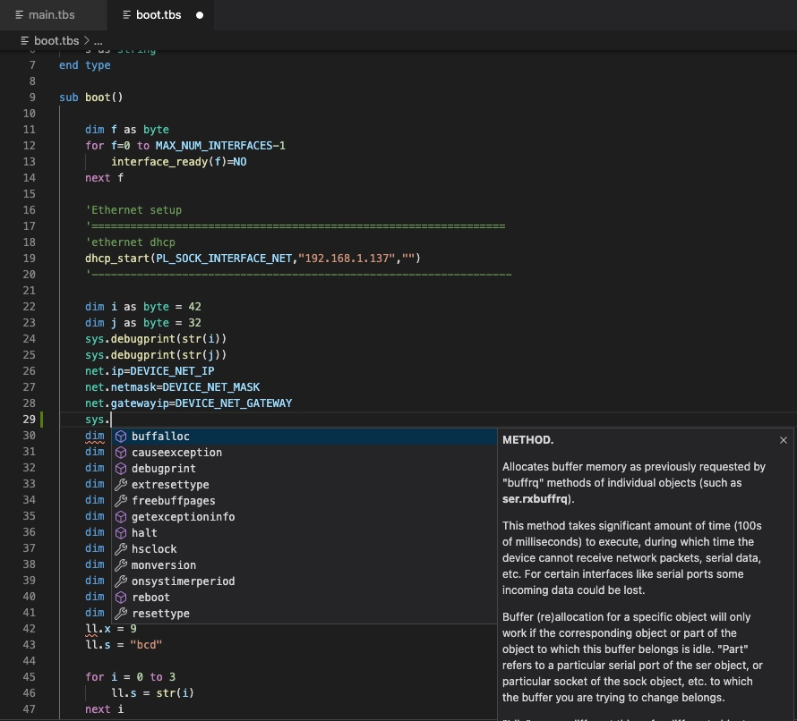

# The Tibbo Basic Programming Language

Tibbo BASIC is a version of the classic BASIC languages that has been around for decades. BASIC spawned hundreds of variants, and no standards exist (or are remembered) that document its features.

Tibbo BASIC applications are event-driven — all code is executed in event handlers, which are invoked in response to events. This is known as event-based execution.

Tibbo BASIC use the static memory model: all RAM is allocated at compile time, and there is no heap. This means that there will be no "out of memory" situations — ever. There is no need for garbage collection, nor is there associated overhead. However, this also means no dynamic sizing of memory structures, no dynamic object creation and destruction, and no recursion or reentrant calls.

Tibbo BASIC is "pure" in that they contain no I/O facilities of any kind (no PRINT, INPUT, etc.). Instead, all I/O is handled by objects.

More information on Tibbo Basic [here](https://docs.tibbo.com/taiko/lang).

More about out IoT Platform [here](https://tibbo.com).

